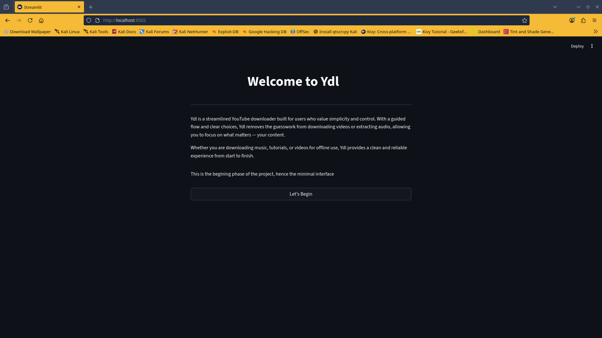
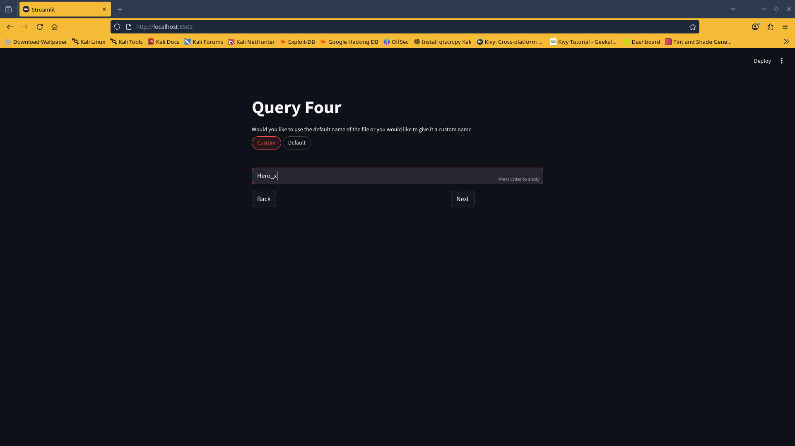
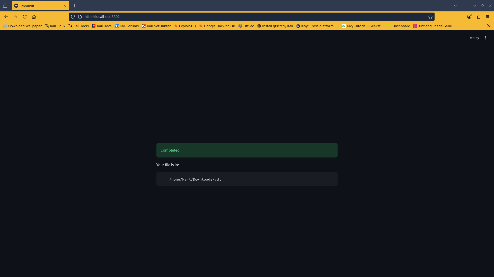

# Ydl Web – Streamlined Video Downloader

**Ydl Web** is a user-friendly, web-based video downloader built with Streamlit and `yt-dlp`.  
It guides users step by step to download videos or extract audio, allowing them to:

- Choose the download format (Video, Audio, or MP3 extract)
- Set a custom file name or use the default title
- Select or create a download directory

Interactive Lottie animations provide visual feedback during processing, making the experience intuitive and engaging.

---

## Features

- Guided, multi-step interface using Streamlit session state
- Flexible download formats: Video, Audio, or MP3 Extract
- Custom file naming or automatic title-based naming
- Automatic folder creation for organized downloads
- Cross-platform support: Windows, Linux, and macOS (FFmpeg required)
- Lightweight and minimalistic web interface

---

## Tech Stack

- Python 3.x
- Streamlit
- yt-dlp
- Streamlit-Lottie
- Requests

---

## Installation

So we are going to cover some steps or things to do to make this succesfull

#   Windows:
So on windows , before you start anything, open powershell as administrator
And run this one command

    winget install ffmpeg 

This command or step is very neccesary for the tool to work 

So after you are done with that and it installs succesfully, we move on to the next step.

Now you have to clone the gihub repo,
In the powershell that you previously opened paste this command in:

    git clone https://github.com/darkwolfamet/Ydl-web.git
    cd Ydl-web
This command will allow the installation of the nessecary files

After that press **`Win + S`** to open the search bar.

In the search bar type "Ydl-web"

Go into the folder and make sure you can see the file extensions and right click on **`setup.bat`** and select run as admin.. to run the tool

**`DO NOT CLICK ON setup.sh IF YOU ARE A WINDOW USER`**

After running the tool, press the enter key in the cmd terminal, a url will appear, take the url and place it in your browser

Make sure your browser is a current version

Then follow the steps

# Linux

Open the terminal

Paste in this code:

    git clone https://github.com/darkwolfamet/Ydl-web.git
    cd Ydl-web
Paste these two follow up commands:

    chmod +x setup.sh
    ./setup.sh
    

## Usage
This is the welcome screen, read the  info

This is where you determine the path to where you want the file to be saved

This is where you input the url off the video you want to download

This is where you select the type of output you want

This is where you determine the name of the file

An animation plays here to show downloading progress

 

The download completes, for fun the animation will still keep playing

Okay then, feel free to email me the dev Carl, DarkWolf at 

    ametkarl71@gmail.com

